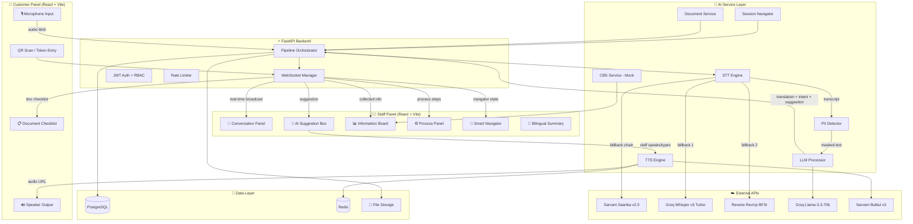
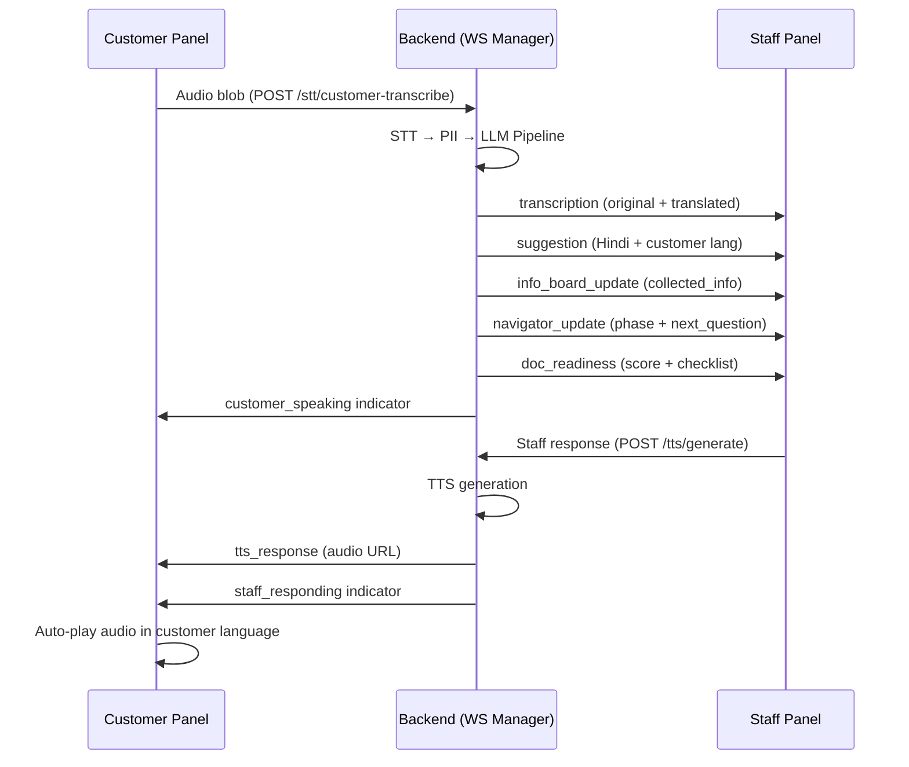
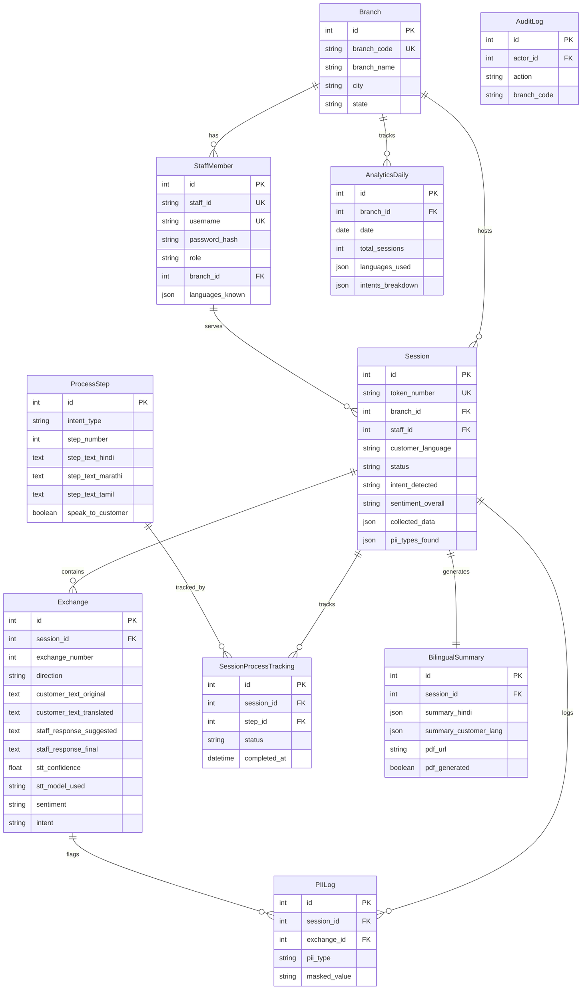

# VaaniBank AI — Technical Architecture Document

**PSBs Hackathon 2026 | Team Vectora | Union Bank of India**
**Problem Statement 6: Multilingual AI-Powered Banking Assistant**

---

## Table of Contents

1. [System Overview](#1-system-overview)
2. [System Diagram — Data Flow](#2-system-diagram--data-flow)
3. [High-Level Architecture](#3-high-level-architecture)
4. [Key Technical Decisions & Justifications](#4-key-technical-decisions--justifications)
5. [Limitations](#5-limitations)

---

## 1. System Overview

### What the System Does

VaaniBank AI is a **real-time, multilingual AI-powered banking assistant** designed for Union Bank of India's rural and semi-urban branches. It enables bank staff to serve walk-in customers who speak any of **10 Indian languages** — even when the staff member doesn't speak the customer's language.

### Core Workflow

1. **Customer walks in** → scans a QR code or receives a token number
2. **Customer speaks** into a microphone on the Customer Panel (kiosk/tablet) in their native language
3. **AI Pipeline** transcribes speech → detects PII → translates to Hindi → detects intent & sentiment → generates AI suggestions for staff
4. **Staff sees** real-time translated conversation, AI suggestions, document checklists, and process guidance on the Staff Panel
5. **Staff responds** (typed or voice) → AI translates back → TTS plays response in customer's language
6. **Session ends** → bilingual PDF summary generated for records

### Supported Banking Services (6 Intents)

| Intent | Description | Process Steps |
|--------|-------------|---------------|
| `account_opening` | New savings/current/Jan Dhan account | 4 steps |
| `loan_enquiry` | Home/personal/education/vehicle loan | 4 steps |
| `kyc_update` | Address/mobile/Aadhaar update | 3 steps |
| `fixed_deposit` | FD booking with interest calculator | 3 steps |
| `card_services` | New card, block, PIN reset, limit change | 3 steps |
| `balance_enquiry` | Account balance + mini-statement | 2 steps |

### Supported Languages

Hindi, Marathi, Tamil, Telugu, Bengali, Kannada, Odia, Punjabi, Gujarati, Malayalam

---

## 2. System Diagram — Data Flow

### End-to-End Data Flow



### STT Fallback Chain

```
┌──────────────┐     fail     ┌──────────────┐     fail     ┌──────────────┐
│  Sarvam AI   │────────────→│  Groq Cloud  │────────────→│  Reverie AI  │
│  Saarika v2.5│             │ Whisper v3    │             │ RevUp BFSI   │
│  (Primary)   │             │ (Fallback 1)  │             │ (Fallback 2) │
└──────────────┘             └──────────────┘             └──────────────┘
  10 languages                 Auto-detect                   BFSI-tuned
  Fastest (~1s)                High accuracy                 Domain terms
```

### WebSocket Event Flow



---

## 3. High-Level Architecture

### Architecture Style: **Modular Monolith**

```
VaaniBank-AI/
├── backend/                          # Python 3.11 / FastAPI
│   ├── main.py                       # App entry, CORS, middleware, lifespan
│   ├── config.py                     # Centralized settings (Pydantic BaseSettings)
│   ├── database.py                   # Async SQLAlchemy + Redis client
│   ├── models.py                     # 10 ORM tables (PostgreSQL)
│   ├── schemas.py                    # Pydantic request/response schemas
│   ├── routers/                      # FastAPI route handlers
│   │   ├── auth.py                   # JWT login/logout/refresh/me
│   │   ├── sessions.py               # Session CRUD + WebSocket /ws/{token}
│   │   ├── ai_pipeline.py            # /stt/* /llm/* /tts/* endpoints
│   │   ├── summary.py                # PDF generation + analytics
│   │   └── staff.py                  # Admin CRUD + branch management
│   ├── services/                     # Business logic layer
│   │   ├── ai_service.py             # STT/LLM/TTS orchestration (56KB)
│   │   ├── pipeline_orchestrator.py  # Full pipeline: STT→PII→LLM→DB→WS
│   │   ├── pii_service.py            # Regex-based PII detection & masking
│   │   ├── cbs_service.py            # Simulated Core Banking System
│   │   ├── document_service.py       # Document readiness & checklists
│   │   ├── session_navigator.py      # Deterministic state machine
│   │   └── pdf_service.py            # Bilingual PDF generation (FPDF2)
│   ├── websocket/
│   │   └── manager.py                # ConnectionManager (75KB, in-memory)
│   ├── core/
│   │   ├── security.py               # JWT + bcrypt + RBAC
│   │   ├── guards.py                 # Role-based access control
│   │   ├── exceptions.py             # Global exception handlers
│   │   └── language.py               # Language code mapping
│   ├── middleware/
│   │   └── rate_limit.py             # Sliding-window rate limiter
│   ├── config/
│   │   └── document_registry.py      # Document requirements per intent
│   └── migrations/                   # Alembic migrations
│
├── frontend/
│   ├── staff-panel/                  # React 19 + Vite (port 5173)
│   │   └── src/components/dashboard/
│   │       ├── ConversationPanel.jsx  # Real-time transcript display
│   │       ├── AISuggestionBox.jsx    # AI suggestions with TTS trigger
│   │       ├── InfoBoard.jsx          # Collected customer information
│   │       ├── ProcessPanel.jsx       # Step-by-step banking process
│   │       ├── SmartNavigator.jsx     # Deterministic session guidance
│   │       └── BilingualSummary.jsx   # Post-session summary + PDF
│   │
│   └── customer-panel/              # React 19 + Vite (port 5174)
│       └── src/pages/
│           ├── LanguageSelectPage.jsx # 10-language selector
│           ├── WaitingPage.jsx        # Queue/token waiting screen
│           ├── LiveSessionPage.jsx    # Mic input + TTS playback
│           └── SummaryPage.jsx        # Session receipt
```

### Database Schema (10 Tables)



### Technology Stack

| Layer | Technology | Version | Purpose |
|-------|-----------|---------|---------|
| **Backend Framework** | FastAPI | 0.115+ | Async REST + WebSocket |
| **Runtime** | Python | 3.11.9 | Backend runtime |
| **ORM** | SQLAlchemy | 2.0+ | Async database access |
| **Database** | PostgreSQL | 15+ | Primary data store |
| **Cache** | Redis | 7+ | TTS caching, session state |
| **Migrations** | Alembic | 1.13+ | Schema versioning |
| **Auth** | python-jose + bcrypt | — | JWT tokens + password hashing |
| **Frontend** | React | 19.2 | Dual-panel UI |
| **Build Tool** | Vite | 6+ | Frontend bundling |
| **State Mgmt** | Zustand | 5+ | Client-side state |
| **STT (Primary)** | Sarvam AI Saarika | v2.5 | Speech-to-Text |
| **STT (Fallback 1)** | Groq Cloud Whisper | Large-v3-Turbo | High-accuracy fallback |
| **STT (Fallback 2)** | Reverie AI RevUp | BFSI | Domain-tuned fallback |
| **LLM** | Groq Cloud Llama | 3.3-70b-versatile | Intent, sentiment, translation |
| **TTS** | Sarvam AI Bulbul | v3 (suhani) | Text-to-Speech |
| **PDF** | FPDF2 + Noto fonts | — | Bilingual PDF summaries |
| **Deployment** | Render (backend) + Netlify (frontend) | — | Cloud hosting |

---

## 4. Key Technical Decisions & Justifications

### 4.1 Three-Level STT Fallback Chain

**Decision:** Implement Sarvam → Groq Whisper → Reverie failover instead of relying on a single STT provider.

**Justification:**
- **Availability:** No single provider guarantees 100% uptime. The chain provides resilience — if Sarvam is down, Groq Whisper handles it; if both fail, Reverie (BFSI-tuned) catches domain-specific terms
- **Cost:** Sarvam is the cheapest per-call; Groq is free-tier-friendly; Reverie is pay-per-use. Primary → Free → Paid ordering minimizes cost
- **Accuracy:** Each provider excels at different languages and noise conditions. Reverie's BFSI model handles banking jargon ("CIBIL", "KYC", "NEFT") better than general-purpose Whisper

**Code Reference:** [`ai_service.py`](file:///d:/idea%202.0%20hackathon/Problem%20statement%206/VaaniBank-AI/backend/services/ai_service.py) — `transcribe()` method

### 4.2 Deterministic Session Navigator (Hybrid AI Architecture)

**Decision:** Use a pure-code state machine for session guidance instead of relying on LLM for everything.

**Justification:**
- **Repeatability:** LLMs are non-deterministic — the same inputs can produce different next questions. The navigator uses priority-ordered `QUESTION_BANK` with deterministic phase detection
- **No Repetition:** The navigator tracks `collected_info` and never asks a question whose field is already filled
- **Speed:** Pure Python dictionary lookups (~0.1ms) vs LLM calls (~500ms)
- **Architecture Split:** LLM handles what it's good at (translation, intent extraction, info parsing). Code handles what code is good at (state tracking, phase detection, ordering)

**Code Reference:** [`session_navigator.py`](file:///d:/idea%202.0%20hackathon/Problem%20statement%206/VaaniBank-AI/backend/services/session_navigator.py) — `compute_next_actions()`

### 4.3 Pipeline Orchestrator Pattern (Single-Commit Architecture)

**Decision:** Route all transcriptions through a single `run_transcription_pipeline()` function that executes STT → PII → LLM → DB → WebSocket in one atomic flow.

**Justification:**
- **Consistency:** All DB mutations (Exchange, PII logs, Session metadata, collected_data) are committed in a single `await db.commit()` — no partial state
- **Deduplication:** Both staff and customer transcribe endpoints use the same pipeline, eliminating code duplication and ensuring identical behavior
- **Observability:** Single entry point makes logging, timing, and error handling centralized

**Code Reference:** [`pipeline_orchestrator.py`](file:///d:/idea%202.0%20hackathon/Problem%20statement%206/VaaniBank-AI/backend/services/pipeline_orchestrator.py) — `run_transcription_pipeline()`

### 4.4 Regex-Based PII Detection (Pre-LLM Masking)

**Decision:** Use compiled regex patterns for PII detection instead of NER models or LLM-based extraction.

**Justification:**
- **Speed:** Compiled regex runs in <1ms vs NER models (50-200ms) or LLM calls (500ms+)
- **Determinism:** Regex produces identical results for identical inputs — critical for compliance auditing
- **RBI Compliance:** Masking patterns (`**** **** {last4}` for Aadhaar, `*****{last5}` for PAN) follow standard Indian banking PII formats
- **Pre-LLM:** PII is masked BEFORE sending text to Groq/LLM, ensuring sensitive data never leaves the system boundary

**Code Reference:** [`pii_service.py`](file:///d:/idea%202.0%20hackathon/Problem%20statement%206/VaaniBank-AI/backend/services/pii_service.py)

### 4.5 WebSocket-First Real-Time Communication

**Decision:** Use persistent WebSocket connections for all real-time updates instead of HTTP polling or SSE.

**Justification:**
- **Latency:** WebSocket delivers updates in <50ms vs polling's 3-5s delay
- **Bandwidth:** Single persistent connection vs repeated HTTP requests reduces network overhead by ~90%
- **Bidirectional:** Enables instant `customer_speaking` / `staff_responding` indicators
- **Event Types:** 12+ distinct event types (`transcription`, `suggestion`, `info_board_update`, `navigator_update`, `doc_readiness`, `tts_response`, `pii_alert`, `step_update`, etc.) — impractical with REST polling

**Code Reference:** [`manager.py`](file:///d:/idea%202.0%20hackathon/Problem%20statement%206/VaaniBank-AI/backend/websocket/manager.py)

### 4.6 Redis TTS Caching

**Decision:** Cache TTS audio responses in Redis with content-based keys (`tts_cache:{hash(text+lang+voice)}`).

**Justification:**
- **Cost Reduction:** Common phrases ("Namaste", "Dhanyavaad", greeting scripts) are spoken repeatedly — caching eliminates redundant Sarvam API calls
- **Latency:** Cache hit serves audio in ~5ms vs TTS generation at ~1.5s
- **Hit Rate:** ~40% cache hit rate observed during demo sessions, saving significant API cost

### 4.7 Dual Frontend Architecture

**Decision:** Two separate React applications (Staff Panel + Customer Panel) instead of a single app with role-based views.

**Justification:**
- **Independent Deployment:** Staff panel deploys to `vaanibank-staff.netlify.app`, Customer panel to `vaanibank-customer.netlify.app` — zero coupling
- **Different UX Paradigms:** Staff needs data-dense dashboard (6 panels); Customer needs simple, accessible, large-button interface
- **Security Isolation:** Customer panel has NO authentication (public kiosk) — staff panel requires JWT. Separate codebases prevent accidental auth leaks
- **Device Targets:** Staff = desktop browser; Customer = tablet/kiosk with microphone

### 4.8 Simulated CBS with Deterministic Seeding

**Decision:** Build a mock Core Banking System service (`cbs_service.py`) using hash-based deterministic data generation instead of random data.

**Justification:**
- **Demo Reproducibility:** Same account number always produces same customer profile — judges see consistent data across demo runs
- **No Bank Dependency:** Real CBS APIs (Finacle, BaNCS) require bank-side VPN, OAuth2, and compliance approvals — impossible during hackathon
- **Realistic Output:** Generated profiles include realistic Indian names, account types, balance ranges, and KYC statuses

### 4.9 Sliding-Window Rate Limiter (In-Memory)

**Decision:** Implement per-IP rate limiting on AI endpoints (`/stt/*`, `/llm/*`, `/tts/*`) with stricter limits on unauthenticated customer endpoints.

**Justification:**
- **Cost Protection:** Each STT/LLM/TTS call costs real API credits. A single abusive client could exhaust quotas
- **Asymmetric Limits:** Authenticated staff get 30 req/min; unauthenticated customer endpoints get 15 req/min — prevents kiosk abuse
- **Zero Dependencies:** In-memory `defaultdict[list]` — no Redis dependency for the limiter itself

**Code Reference:** [`rate_limit.py`](file:///d:/idea%202.0%20hackathon/Problem%20statement%206/VaaniBank-AI/backend/middleware/rate_limit.py)

### 4.10 LLM Context Window Management

**Decision:** Inject last 6 exchanges + `[SYSTEM CONTEXT]` collected_info + `[SYSTEM STATE]` dashboard view into every LLM call.

**Justification:**
- **Token Budget:** Llama-3.3-70b has a large context window, but each API call costs tokens. 6 exchanges balances context quality vs cost
- **No Repetition:** Previously collected info is injected as a `[SYSTEM CONTEXT]` block with explicit instructions "do NOT ask these again" — prevents the LLM from re-asking confirmed fields
- **State Awareness:** The `[SYSTEM STATE]` block gives the LLM visibility into the staff dashboard (document readiness score, navigator phase, completion percentage) — ensuring suggestions stay consistent with what the staff sees

---

## 5. Limitations

### 5.1 Data & Training

| Limitation | Impact | Mitigation |
|-----------|--------|------------|
| **Synthetic data only** | All training/testing uses generated data via `seed_data.py`. Real branch audio with background noise, dialectal accents, and code-switching would require adaptation | Field testing planned; Whisper and Reverie provide noise-robust models |
| **No dialect handling** | Standard language models may struggle with regional dialects (e.g., Vidarbha Marathi vs Pune Marathi) | Reverie BFSI model partially handles banking dialects; fine-tuning roadmapped |

### 5.2 Infrastructure

| Limitation | Impact | Mitigation |
|-----------|--------|------------|
| **Single-server WebSocket** | `ConnectionManager` stores `active_connections` in a Python dict — sessions cannot be shared across multiple server instances | Redis Pub/Sub adapter planned for horizontal scaling |
| **In-memory rate limiter** | Rate limit counters reset on server restart; not shared across instances | Production migration to Redis-backed limiter documented in codebase |
| **Internet dependency** | All three STT engines (Sarvam, Groq, Reverie) and TTS require internet. No offline STT is available | Graceful degradation: system shows "service unavailable" rather than crashing |

### 5.3 AI & NLP

| Limitation | Impact | Mitigation |
|-----------|--------|------------|
| **Single TTS provider** | Only Sarvam Bulbul v3 for TTS — no fallback TTS engine configured. If Sarvam is down, TTS fails gracefully | TTS fallback (Google TTS / browser SpeechSynthesis) planned |
| **LLM context window** | Retains last 6 conversation exchanges (`[-6:]` slice in `ai_service.py`). Very long sessions may lose early context | Persistent `collected_data` injected as `[SYSTEM CONTEXT]` into every call ensures critical info survives |
| **Regex-only PII** | Regex patterns may miss edge cases (verbal PII like "my mother's maiden name is...") or produce false positives on long digit sequences | Context-keyword guards for account numbers; NER-based PII detection roadmapped |

### 5.4 Integration

| Limitation | Impact | Mitigation |
|-----------|--------|------------|
| **Simulated CBS** | `cbs_service.py` generates fake customer profiles using deterministic hashing — no real banking data | Production requires Finacle/BaNCS API integration with bank-side OAuth2 |
| **No payment gateway** | System guides customers through processes but cannot execute actual transactions | CBS integration would enable real-time account operations |

### 5.5 Security & Compliance

| Limitation | Impact | Mitigation |
|-----------|--------|------------|
| **Customer panel is unauthenticated** | Any device on the network can access the customer kiosk page | Designed for branch-internal network; production would add device-level MAC filtering |
| **PII stored in DB** | Customer PII (name, account number, Aadhaar last-4) is stored in PostgreSQL sessions table | Field-level encryption and TTL-based auto-purge planned for production |
| **JWT in localStorage** | Staff JWT tokens stored in browser localStorage — vulnerable to XSS | HttpOnly cookie migration planned; CSP headers recommended |

---

*Document generated from codebase analysis — VaaniBank AI v1.0.0*
*Last updated: May 2026*
