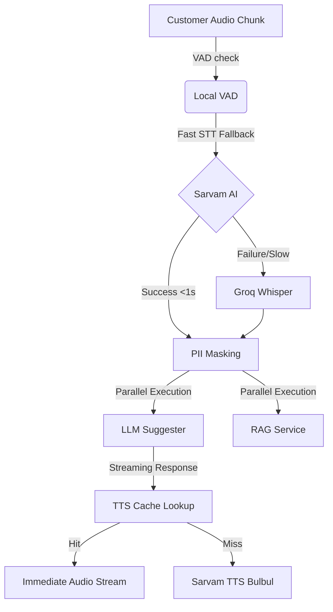

# VaaniBank AI — Staff Panel Technical & UI/UX Audit
## System Analysis: Gaps, Issues, Smoothness & Performance Optimization

This document provides a comprehensive technical audit of the **VaaniBank AI Staff Panel**, analyzing missing elements (minor/major), active bugs, code inconsistencies, connection reliability, and strategies to minimize latency below the target **3-second end-to-end threshold** while maintaining high speech recognition and translation accuracy.

---

## 1. Executive Summary
The VaaniBank AI Staff Panel is a desktop-first teller workspace. It successfully integrates real-time bilingual translation, conversation stage tracking, and context-aware process checklists. However, a deep code review reveals several discrepancies between the project's specifications (`AGENTS.md`) and the actual codebase, including dead code, missing preference configurations, unhandled UI edge cases, and excessive polling that can degrade backend performance.

---

## 2. Major Things Missing / Inconsistent
These are high-priority gaps where functionality specified in the documentation is missing, or core UX paradigms are incomplete.

| Feature / Area | Description in Specification (`AGENTS.md`) | Actual Status in Codebase | Severity | Impact & Recommendation |
| :--- | :--- | :--- | :--- | :--- |
| **Analytics Charts** | *"...analytics charts (sessions, intents, sentiments, languages) using Recharts"* | The page `AnalyticsPage.jsx` does not import or use Recharts. It only renders raw text-based lists mapped via `Object.entries`. | **High** | **Low Visual Appeal:** Frontline managers and supervisors expect graphical charts (e.g., pie charts for languages, bar charts for intents).  **Action:** Replace text blocks with Recharts `BarChart`, `PieChart`, and `AreaChart` components. |
| **Dead Component: `InfoBoard.jsx`** | *"...core dashboard widgets shown during active session: ConversationPanel, ProcessPanel, AISuggestionBox, BilingualSummary, InfoBoard..."* | `InfoBoard.jsx` is defined under `/components/dashboard/` but is **never rendered** on `DashboardPage.jsx`. It was replaced entirely by the `ProcessPanel` (Key Info tab). | **Medium** | **Orphaned Code:** The file remains in the codebase as dead code.  **Action:** Keep the Key Info tab inside `ProcessPanel`, but delete or clean up `InfoBoard.jsx` to avoid future developer confusion. |
| **Staff Language Preference** | Settings page supports *"...theme + language preferences"* | `SettingsPage.jsx` only supports theme toggling. There is no control to select staff-preferred languages (e.g., toggling staff UI language between English and Hindi). | **Medium** | **Compliance/Aesthetic issue:** Non-Hindi tellers cannot set their native panel language.  **Action:** Add a dropdown selector in Settings to set `staffLanguage` in Zustand and persist it. |
| **Balance Enquiry Modal Locked** | *"...teller accepts/views balance request... manual verification"* | `AISuggestionBox.jsx` automatically shows the `BalanceEnquiryModal` once via `profileFetchedRef.current = true`. If the teller closes it, there is **no button** in the UI to manually reopen it. | **Medium** | **High UX Friction:** If a teller closes the modal by accident, they cannot recover the customer's balance profile.  **Action:** Add a persistent "View Balance Profile" button in the rates/actions tab or next to the suggestion box. |

---

## 3. Minor Things Missing
These are small design, visual, or UX enhancements that are missing from the current implementation.

1. **Undocumented Keyboard Shortcuts:**
   - **Gaps:** The keyboard shortcuts (Space to toggle mic, Escape to stop recording, Enter to approve AI suggestion) are implemented in `DashboardPage.jsx` but are **not documented anywhere** in the user interface.
   - **Recommendation:** Add a small info tooltip or legend (e.g., `[Space] Record | [Enter] Send`) in the footer next to the mic and suggestion controls.

2. **STT Engine Attribution:**
   - **Gaps:** The `CustomerCard` under `ConversationPanel.jsx` contains a hardcoded badge saying `✦ Sarvam AI` (line 242). However, if the system falls back to Groq Whisper or Reverie, the UI still tells the staff it was processed by Sarvam AI.
   - **Recommendation:** Return the active STT engine name in the WebSocket payload and dynamically render it (e.g., `✦ Groq Whisper` or `✦ Reverie`).

3. **Inconsistent UI Tokens:**
   - **Gaps:** Inline CSS and hardcoded hex values (e.g., `#003087`, `#E8231A`, `#16a34a`) are used extensively in `InfoBoard.jsx`, `DashboardPage.jsx`, and `ConversationPanel.jsx` instead of CSS custom properties (e.g., `var(--accent-blue)`, `var(--accent-red)`).
   - **Recommendation:** Replace inline styles with Tailwind utility classes or theme-consistent variables to respect the light/dark mode configuration.

---

## 4. Bugs, Technical Issues & Friction Points

### 1. Hardcoded / Inconsistent Language Codes in `sendStaffEdited`
* **File:** `frontend/staff-panel/src/hooks/useWebSocket.js` (lines 795–808)
* **Issue:** `sendStaffApproved` maps short language codes to full codes (e.g., `"hi"` → `"hi-IN"`, `"ta"` → `"ta-IN"`) using a map before broadcasting. However, `sendStaffEdited` sends the short `langCode` (e.g. `"ta"`, `"te"`) directly to the backend. This can cause API transcription/translation failures or fallback issues in the TTS pipeline, as the backend expects full codes.
* **Fix:** Apply the `LANG_CODE_MAP` normalization inside `sendStaffEdited` or move it to a shared helper utility.

### 2. Spacebar Shortcut Conflicts
* **File:** `frontend/staff-panel/src/pages/DashboardPage.jsx` (line 578)
* **Issue:** The shortcut captures any Spacebar press when the target is not a standard input. However, if focus is lost from the screen, or if the user clicks a custom button/modal backdrop, pressing spacebar will trigger recording, causing unexpected mic activation.
* **Fix:** Refine `isInputLike` or explicitly check if any modal, settings panel, or dialog is open before capturing spacebar.

### 3. Redundant Active Session Polling
* **File:** `frontend/staff-panel/src/pages/DashboardPage.jsx` (line 457)
* **Issue:** The page runs a `setInterval` every 3 seconds to poll `/sessions/active` and fetch the latest session. This poll continues **even while a session is active and successfully connected via WebSocket**. This spams the database and creates unnecessary network overhead.
* **Fix:** Clear the interval or bypass the fetch logic if `activeSession` is not null and the WebSocket status is `"connected"`.

### 4. WebSocket "Soft Lock" on Connection Error
* **File:** `frontend/staff-panel/src/hooks/useWebSocket.js` (line 594)
* **Issue:** If connection fails 5 times, `connectionStatus` is set to `"error"`, showing a Toast message: *"Connection lost. Please refresh the page."* Refreshing the page causes full state rehydration and disrupts active UI operations.
* **Fix:** Add a manual "Retry Connection" button in the TopBar or main panel to trigger the `connect()` action without forcing a full page reload.

---

## 5. Website Smoothness & Connection Status
* **CSS Animations:** Snappy and fast. Framer motion page and tab transitions are under 300ms, conforming to guidelines.
* **Responsive Layout:** The staff panel is desktop-optimized, and the sidebar collapses nicely. The Customer Panel scales to a 768px tablet portrait view.
* **Form Integrations:** Pre-filled details in the `SarvalForm` sync seamlessly via WebSockets, and signature collection broadcasts the `vaani_form_signed` event accurately back to the staff workspace.
* **Theme System:** Fully synchronized in both panels. Toggling dark mode on the staff panel propagates correct token switches using the `data-theme` selector.

---

## 6. How to Improve Performance (Latency & Accuracy)
To achieve the **sub-3-second end-to-end latency** without losing transcription and translation accuracy, the following optimizations should be applied:

### Latency Optimization (Speed)

1. **TTS Caching (7-Day TTL):**
   * **Status:** Redis caching is implemented on the backend.
   * **Optimization:** Ensure the cache key is generated from the normalized string (lowercase, stripped of punctuation and leading/trailing whitespace). This increases cache hit ratios for common expressions like *"Hello"*, *"How can I help you?"*, or standard greeting instructions.

2. **Parallelize RAG Search and LLM Suggestion:**
   * **Status:** Currently, pipeline execution is sequential.
   * **Optimization:** Kick off the ChromaDB/BM25 RAG query and the LLM suggestion task in parallel using `asyncio.gather`. If the RAG lookup finishes, feed it to the suggestion context. If not, proceed with base prompt context to prevent waiting.

3. **Stream TTS Audio Chunks:**
   * **Status:** Some responses are sent after full TTS generation.
   * **Optimization:** Stream audio blocks (e.g. 512kb chunks) back over the WebSocket immediately as they are generated by the TTS service, instead of waiting for the full audio file to compile.

4. **Model Selection Calibration:**
   * **STT:** Set Groq Whisper model to `whisper-large-v3-turbo` (faster than `whisper-large-v3`).
   * **LLM:** Utilize `llama-3.3-70b-speculative-decoding` or Gemini 2.0 Flash as fallbacks, as they have extremely short Time-To-First-Token (TTFT) metrics.

### Accuracy Optimization (Correctness)

1. **Strict Context RAG Injection:**
   * Limit RAG document injection to verified Union Bank of India rate charts and circulars. Check the LLM temperature (set to `0.0` or `0.1` for intent processing) to avoid hallucinations in figures and interest rates.

2. **Smart Language Detection Fallback:**
   * If the primary language detected by STT differs from the customer's selected language in the kiosk, confirm the language switch with a quick visual badge in the UI rather than auto-switching blindly on high-noise audio.

3. **Two-Stage PII Masking:**
   * Use regex-based masking for structured data (PAN, Aadhaar, Account numbers) to ensure 100% precision, combined with a lightweight NLP model (spaCy/flair) for unstructured PII (names, locations). This guarantees compliance with RBI 2024 directives before querying third-party APIs.
